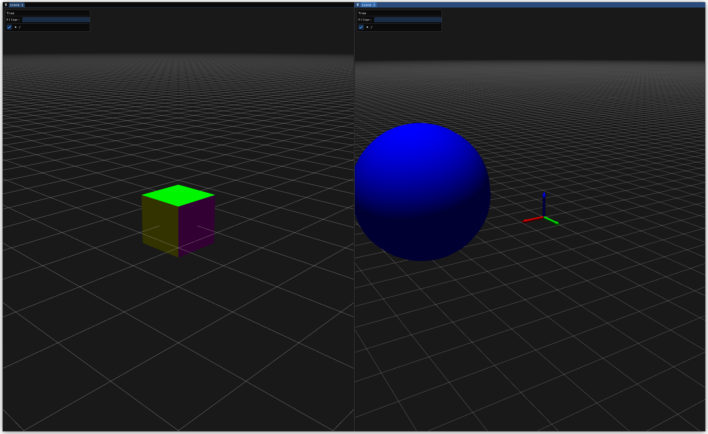

---

SlamDunk is a powerful and user-friendly Python library for making live 3D and 2D visualizations for prototyping, data exploration, and algorithm development.

It is very lightweight, built using OpenGL and ImGui.

# Examples

## Hello world

Here is a simple "hello world" program for a SlamDunk visualization.

```python
import slamd

if __name__ == "__main__":
    vis = slamd.Visualizer("Hello world")

    scene = vis.scene("scene")

    scene.set_object("/origin", slamd.geom.Triad())

    vis.hang_forever()
```

This example highlights the main components of SlamDunk.

The `Visualizer` object maintains the state of the visualization, and starts a TCP server that the visualization window connects to.

By default, it spawns a window process that reads from it and displays the visualizations. You can opt out of this with the `spawn` argument, and control the port with the `port` argument.
In this case, you can start a window with the `slamd-window` executable:

```
slamd-window --port [port] --ip [ip]
```

This client-server architecture allows launching a visualizer a remote server, and connecting to it on your local machine.

A `Scene` object represents and contains a tree of 3D objects, accessed by paths like `/comp1/comp2/comp3`. 3D poses and `Geometry` objects can be assigned with the `set_transform` and `set_object` methods.

`Geometry` objects represent the objects that are displayed in the scene.

Running this program results in the following interactive visualization:


## Multiple scenes

SlamDunk uses ImGui to allow multiple sub-windows with floating and docking support inside the SlamDunk viewer. The following example illustrates creating two windows, each showing its own scene.

```python
# python
import slamd
import numpy as np

if __name__ == "__main__":
    vis = slamd.Visualizer("two windows")

    scene1 = vis.scene("scene 1")
    scene2 = vis.scene("scene 2")

    scene1.set_object("/box", slamd.geom.Box())

    scene2.set_object("/origin", slamd.geom.Triad())

    scene2.set_object("/ball", slamd.geom.Sphere(2.0))

    sphere_transform = np.identity(4, dtype=np.float32)
    sphere_transform[:, 3] = np.array([5.0, 1.0, 2.0, 1.0])

    scene2.set_transform("/ball", sphere_transform)

    vis.hang_forever()

```

The resulting window looks like this:



The windows are fully controllable - you can drag then around, make tabs, use them in floating mode, dock them to the sides like you see in the screenshot. All of this is supported by [ImGui](https://github.com/ocornut/imgui).

Here is a slightly more elaborate example of something you can do with SlamDunk:


Or this one:

## Supported geometry primitives

### 3D

- Camera Frustums (with optional image) (`slamd.geom.CameraFrustum`)
- Arrows/Vectors (`slamd.geom.Arrows`)
- Arbitrary meshes (`slamd.geom.Mesh`)
- Planes (`slamd.geom.Plane`)
- Point Clouds (`slamd.geom.PointCloud`)
- Piecewise linear curves (`slamd.geom.PolyLine`)
- Spheres (`slamd.geom.Sphere`)
- Triads/reference frames (`slamd.geom.Triad`)

## 2D

- Images (`slamd.geom2d.Image`)
- Points (`slamd.geom2d.Points`)
- Piecewise linear curves (`slamd.geom2d.PolyLine`)
- Circles (`slamd.geom2d.Circles`)

## Further reading

The examples in `python_examples` showcase some more features of SlamDunk. Some examples are canvases for 2D visualizations and lots of additional geometry primitives such as point clouds, meshes, camera frustums, etc.

# Installation

Wheels are available on [PyPi](https://pypi.org/project/slamd/), so you can simply

```bash
pip install slamd
```

# Contributions

All contributions and feedback are welcome and apprechiated!
